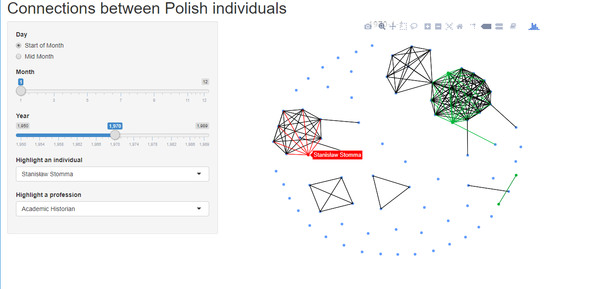

**Co-Authors:**  [Gregory Domber](https://history.calpoly.edu/faculty/greg-domber) and Kien Nguyen.

## Historical Context

In 1989, the country of Poland underwent a peaceful revolution, replacing its existing Communist government with a Democratically elected one.  The culminating moment of this process was a Round Table agreement reached between leaders of the Opposition and Communist groups. 

How did this movement build over the decades prior, and how did these two groups come together?  Our project aims to quantify the evolution of social network between key individuals and organizations over the years before 1989.

## Dataset

This project began with the work of Dr. Gregory Domber (History Department, Cal Poly) to collect extensive data on the activities of Round Table participants prior to the revolution.  Relying on records from Polish archives and news going back decades, Dr. Domber assembled a rich dataset documenting the organizational affiliations of every Opposition party member.

A complexity of this data is the variable-time nature of individual affiliations.  A given person may be affliated with an organization like a University for decades, but they may be affiliated with a political party for only a couple years, or they may participate in a one-day even like a protest.  To explore this data, we needed a dynamic approach that let us watch connections build over time.

## Shiny App

My first contribution to this project was to process the data into clean form, and then construct an R Shiny application that visualized snapshot social networks at given time points.

This application allowed Dr. Domber and his colleagues to interactively explore the data.  Functionality was added to highlight certain individuals or demographic details, so that the historians could extract contextual insight from the displayed network.

## Future Work

This project is currently being expanded to statistically identify significant change points in the social network; i.e., moments where the Polish political landscape suddenly shifted.  A preliminary version of this analysis was performed as a [Senior Project by Cal Poly Student Kien Nguyen.](/projects/polish_networks/SeniorArticle.pdf)

Meanwhile, Dr. Domber continues to collect data on the Communist attendees of the Round Table meeting, with the eventual goal of a dual study of the connections between these two groups.

