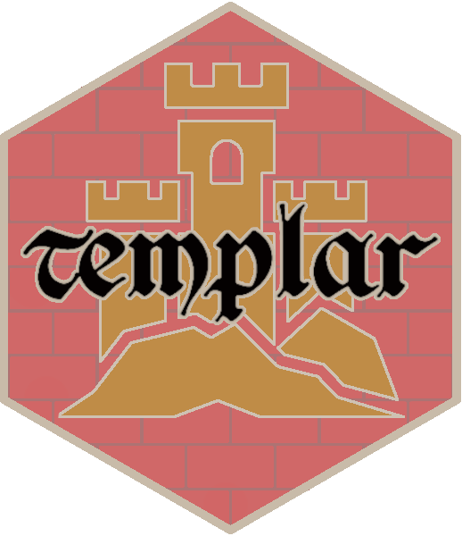

**Co-authors:**  [Ian Flores Siaca](https://twitter.com/iflores_siaca) and [Desirée De Leon](https://twitter.com/dcossyle)

## [templar](https://github.com/r-for-educators/templar) is a package that lets educators auto-generate repetitive course material content from R Markdown source files and yaml headers.

---

### About

This package is still in development.

The goal is to create a set of templates for course material sets, such as the syllabus, assignments, exams, and labs.  Information about each course will be 
stored in one unified yaml file, so that the materials can be updated each year
(or quarter or semester) without having to hunt through each individual file 
and search for dates and details.

